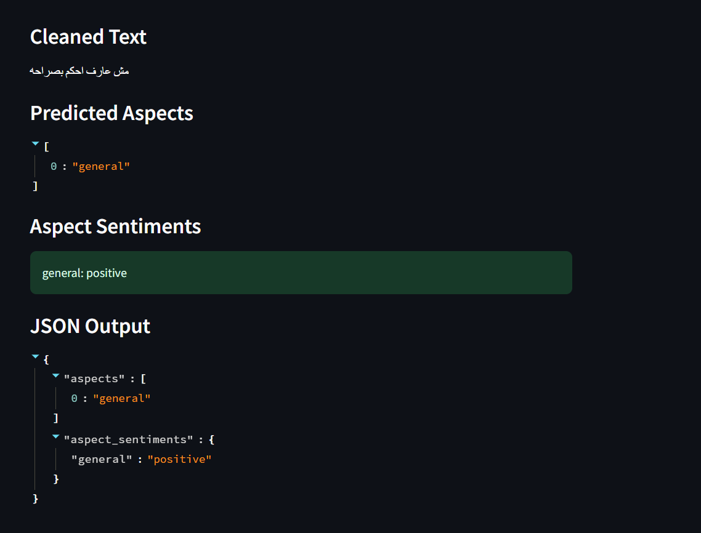
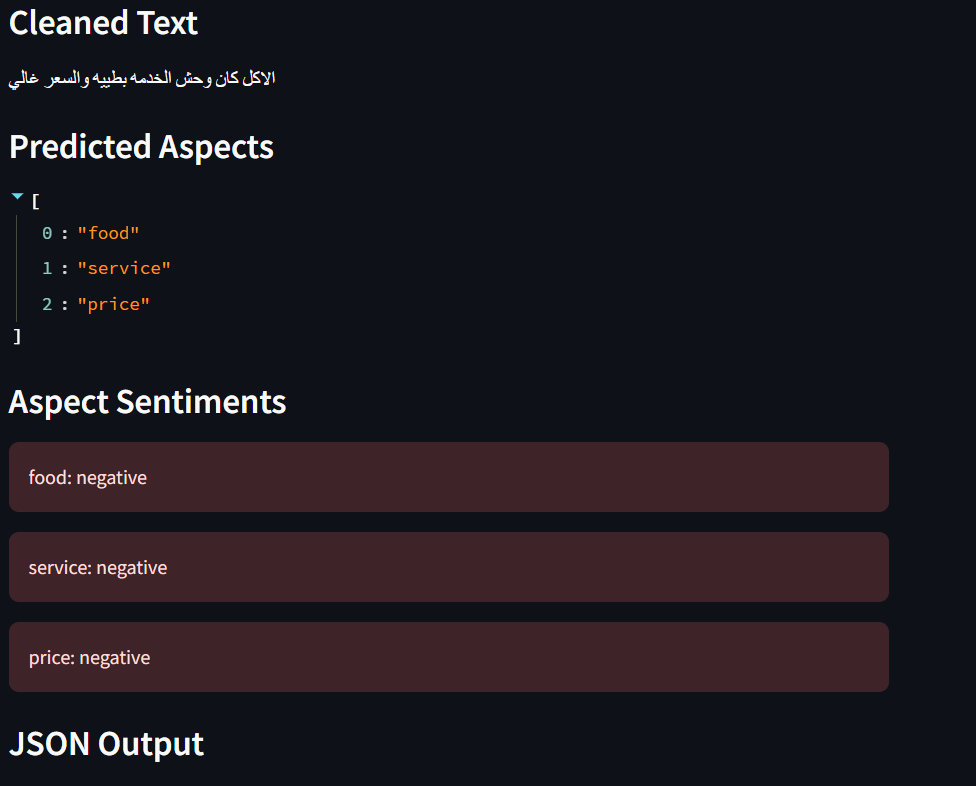

تمام 👌 خديه Copy/Paste مباشرة:

````md
# Aspect-Based Sentiment Analysis (ABSA)

This project was developed for the DeepX Hackathon.  
The goal is to analyze Arabic customer reviews and extract:

1. The aspects mentioned in each review  
2. The sentiment for each aspect  

The final output is a JSON file following the required submission format.

---

## Task Description

Given a review, the system predicts one or more aspects from:

- food
- service
- price
- cleanliness
- delivery
- ambiance
- app_experience
- general
- none

Then, for each detected aspect, it predicts the sentiment:

- positive
- negative
- neutral

Example:

```json
{
  "review_id": 23,
  "aspects": ["service", "food"],
  "aspect_sentiments": {
    "service": "positive",
    "food": "negative"
  }
}
````

---

## Project Structure

```text
DeepX_Hackathon_neurix/
│
├── notebooks/
│   └── 01_data_exploration.ipynb
│
├── src/
│   ├── train_aspect_model.py
│   ├── train_sentiment_model.py
│   └── predict.py
│
├── outputs/
│   └── predictions.json
│
├── requirements.txt
├── README.md
└── .gitignore
```

---

## Approach

The solution is a two-stage pipeline:

### 1. Aspect Detection

A multi-label classifier that detects all aspects in a review.

### 2. Aspect Sentiment Classification

A second model that predicts sentiment for each detected aspect.

Input:

```text
review_text + aspect
```

---

## Model

The models are based on:

```text
UBC-NLP/MARBERTv2
```

It works well with informal Arabic and mixed-language text.

---

## Data Processing

The preprocessing includes:

* Cleaning text (removing symbols and emojis)
* Arabic normalization
* Reducing repeated characters
* Keeping meaningful Arabic and English words
* Preparing multi-label targets for aspects
* Building a dataset for aspect-level sentiment

---

## Training

Train aspect model:

```bash
python src/train_aspect_model.py
```

Train sentiment model:

```bash
python src/train_sentiment_model.py
```

---

## Prediction

Run:

```bash
python src/predict.py
```

Output:

```text
outputs/predictions.json
```

---

## Submission Format

```json
[
  {
    "review_id": 1,
    "aspects": ["service"],
    "aspect_sentiments": {
      "service": "positive"
    }
  }
]
```

---

## Installation

```bash
pip install -r requirements.txt
python -m venv venv                                                                                
venv\Scripts\activate        

```
## streamlit 

streamlit run app/streamlit_app.py

```
## Demo

The system can handle simple and ambiguous reviews.

Example:

Input:
"مش عارف احكم بصراحة"

Output:
- general → positive

### Application Interface



---
The system can handle both multi-aspect reviews and ambiguous cases.

### Example 1: Multi-aspect review

Input:
"الأكل كان وحش  الخدمة بطيئة والسعر غالي"

Output:
- food → negative
- service → negative  
- price → negative  



---

